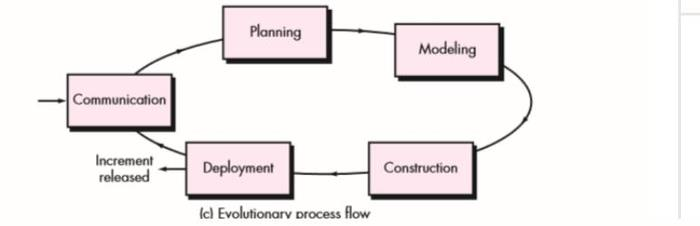
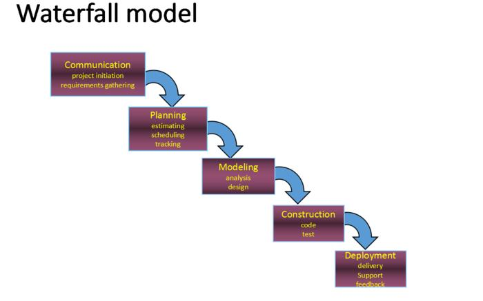
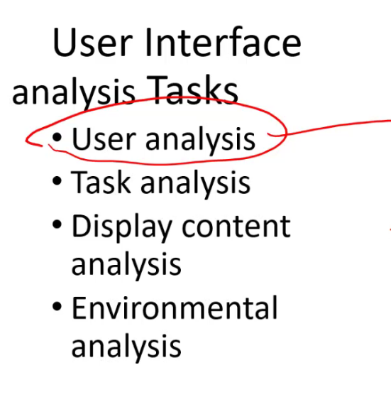
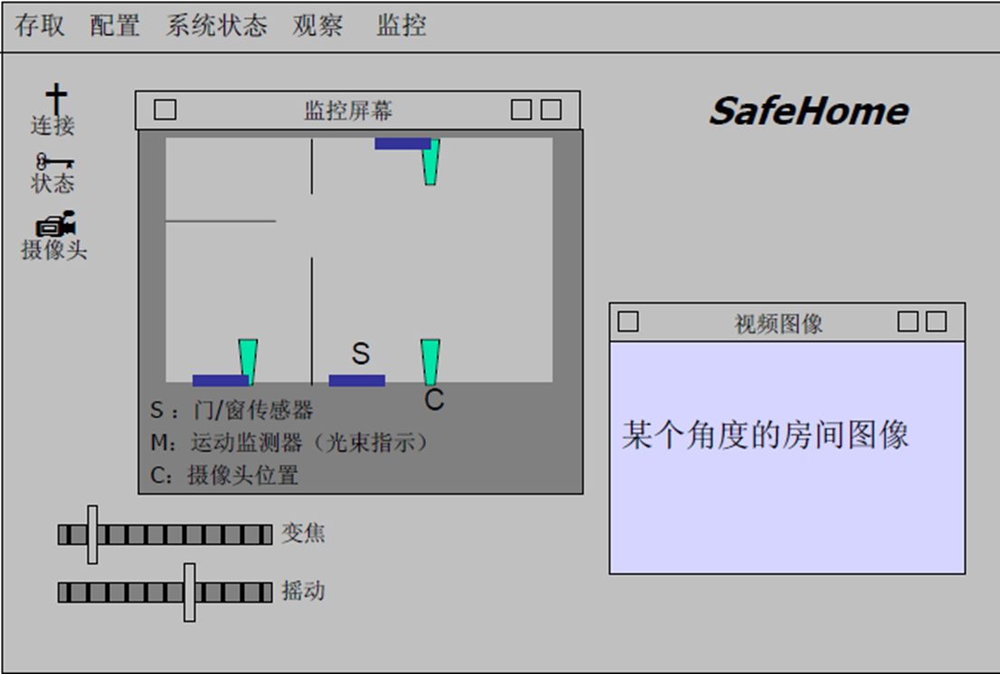
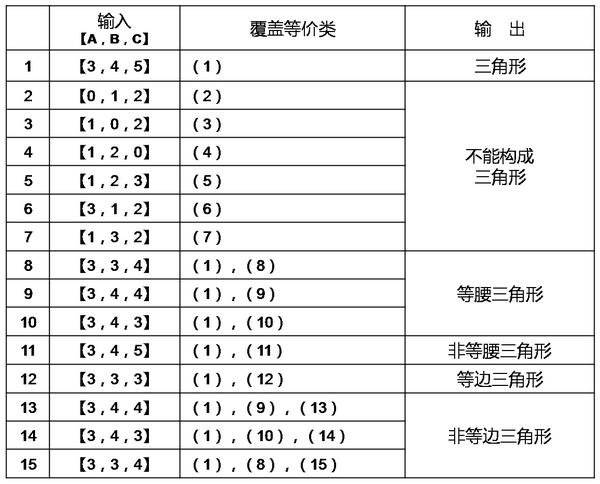
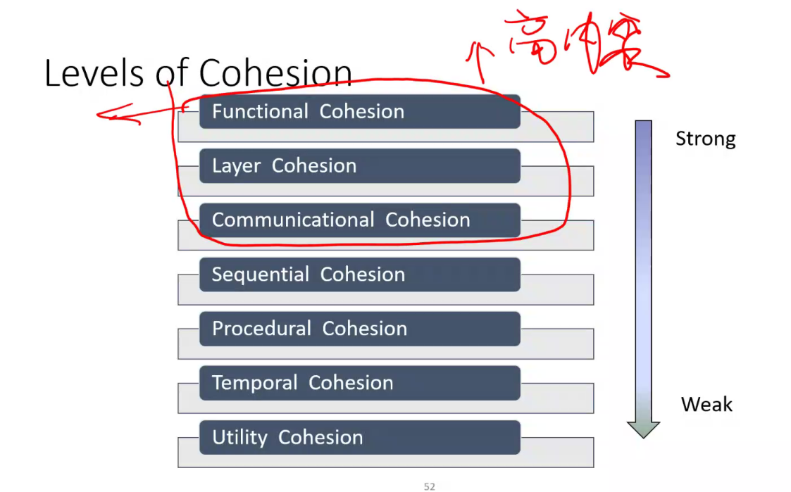

**Software：**

（1）指令的集合，通过执行这些指令可以满足预期的特征、功能和性能需求；

（2）数据结构，使得程序可以合理利用信息

（3）软件描述信息，它以硬拷贝和虚拟形式存在，用来描述程序操作和使用

| **出错名称**                 | **系统输出信息**             | **处理方法**         |
| ---------------------------- | ---------------------------- | -------------------- |
| 用户名输入错误               | 用户名或密码错误             | 返回登录界面         |
| 密码输入错误                 | 用户名或密码错误             | 返回登录界面         |
| 输入格式错误                 | 输入格式错误，请重新输入     | 返回输入界面         |
| 数据库连接失败               | 数据库连接失败，请检查连接   | 返回操作前的页面     |
| TCP连接错误                  | 连接超时，请检查连接         | 返回操作前的页面     |
| 不允许为空的输入框输入空字符 | 输入为空，请输入             | 弹回原输入页面输入处 |
| 系统故障                     | 服务器出现故障，请联系管理员 | 立刻启用备用机       |

# **Software Engineering：**

软件工程是：

（1）将系统化的、规范化、可量化的方法应用于软件的开发、运行和维护，即将工程化方法应用于软件。

（2）在（1）中所述方法的研究

## **What the difference between software and hardware?**

1.软件是设计开发的，而不是传统意义上生产制造的。

2.软件不会“磨损”

3.大多数软件根据实际的顾客需求定制的。

## **Why does software need Change or Evolved?**

 **遗留软件（legacy software）：**

> 遗留软件系统……在几十年前开发，它们不断被修改以满足商业需要和计算平台的变化。这类系统的繁衍使得大型机构十分头痛，因为它们的维护代价高昂且系统演化风险较高。

**发生原因：**

- 软件需要进行**适应性调整（adapt）**，从而可以满足新的计算环境或者技术的需求。
- 软件必须**升级（update）**以实现新的商业需求。
- 软件必须**扩展（extend）**使之具有与更多新的系统和数据库的互操作能力。
- 软件架构必须进行**改建（re-architect）**使之能适应多样化的网络环境。

## 层次化技术

支持软件工程的根基在于**质量关注点（quality focus）**：是对软件的组织承诺，是支持软件工程的基石

软件工程的基础是**过程（process）层**。软件过程将各个技术层次结合在一起，使得合理、及时地开发计算机软件成为可能。

软件工程**方法（method）**为构建软件提供技术上的解决方法。方法包括：沟通、需求分析、设计模型、编程、测试和技术支持。

# **Software Process ：**

**软件过程：**软件过程是工作产品构建时所执行的一系列活动、动作和任务的集合。层次关系：

- 软件过程
  - 过程框架
    - 普适性活动
      - 框架活动
        - 软件工程动作
          - 任务集
            - 质量保证点、项目里程碑等

## **Generic Framework Activity(通用框架活动)**

适用于所有软件项目，无论其规模和复杂程度如何：

**1. 沟通（Communication）：**目的是理解利益相关者的项目目标，并收集需求以定义软件特性和功能。

**2. 策划（Planning）：**定义和描述了软件工程工作，包括需要执行的技术任务、可能的风险、资源需求、工作产品和工作进度计划。

**3. 建模（Modeling）：**利用模型哎更好地理解软件需求并完成符合这些需求的软件设计。

**4. 构建（Construction）：**它包括编码和测试以发现编码中的错误。

**5. 部署（Deployment）：**软件交付到用户，用户对其进行评测并给出反馈意见。

在项目的多次迭代过程中，沟通、策划、建模、构建、部署等活动不断重复。每次==项目迭代==都会产生一个软**件增量( software increment)**，每个软件增量实现了部分的软件特性和功能。随着每一次增量的产生，软件逐渐完善。

## **Umbrella Activities（普适性活动）：**

**普适性活动贯穿软件项目始终。**

**1.软件项目跟踪和控制：**项目根据计划评估项目进度，并且采取必要的措施保证项目按进度计划进行。

**2.风险管理：**对可能影响项目成果或者产品质量的风险进行评估。

**3.软件质量保证：**确定和执行软件质量保证的活动

**4.技术评估：**评估软件工程产品、尽量在错误传播到下一个活动之前，发现并清除错误。

**5.测量：**定义和收集过程、项目和产品的度量，以帮助团队在发布软件的时候满足利益相关者要求。同时，测量还可以与其他框架活动和普适性活动配合使用。

**6.软件配置管理：**在整个软件工程中，管理变更所带来的影响。

**7.可复用管理：**定义产品复用的标准，并且建立构建复用机制。

**8.工作产品的准备和生产：**包括了生产产品所必需的活动。

## **Process Flow**

**过程流：**描述了在执行顺序和执时间上，如何组织框架中的活动，动作，任务。

- **线性过程流（Liner process flow）：**从沟通到部署顺序执行五个框架活动。

- **迭代过程流（iterative process flow）：**在执行下一个活动前重复执行之前一个或多个活动。

  

- **演化过程流（evolution process flow）：**采取循环的方式执行各个活动。

- **并行过程流（parallel process flow）：**将一个或是多个活动与其他活动并行执行。

## **过程模式（process pattern）**

描述了软件工程工作中遇到的过程相关的问题、明确了问题环境并给出了针对该问题的一种或几种可证明的解决方式。

## **Process Model**

惯用过程模型是为了改变软件开发的混乱状态，促使软件开发更加有序。

### **瀑布模型（waterfall model）**

**又被称为经典生命周期（classic life cycle），它提出了一个系统的、顺序的软件开发方法。**

**优点：**

有利于大型软件开发过程中人员的组织、管理，从而提高了大型软件项目开发的质量和效

率。

当需求确定、工作采用线性的方式完成的时候瀑布模型是一个很有用的过程模型。

一个有用的过程模型，其中需求是固定的，工作将以线性方式完成。

**缺点:**

过于理想，缺乏灵活性，容易产生需求偏差。

实际的项目很少遵守瀑布模型提出的顺序。

客户通常很难清除的描述所有的需求。

客户必须要有耐心，因为只有在项目接近尾声的时候，他们才能的带执行的程序。

**适用范围：**需求确定，工作能够采用线性的方式完成的软件。

### **V 模型（V-model）：**

描述了质量保证动作同沟通、建模相关动作以及早期构建相关的动作之间的关系。

V 模型强调软件开发的协作和速度，将软件实现和验证有机地结合起来，在保证较高的软

件质量情况下缩短开发周期。

**优点：**适合工程量小、人力资源少并且开发过程中改动不大的项目

**缺点：**错误发现时间迟，产生的风险代价高

### **增量过程模型（Incremental Model）**

增量过程模型侧重于每一个增量都提交一个可以运行的产品。

**优点：**

1. 能在较短的时间内向用户提交可完成部分工作的产品。

2. 逐步增加产品功能可以使用户有充裕的时间学习和适应新产品，从而减少一个 全新的软件可能给客户组织带来的冲击。

3. 规避技术风险

4. 可并行开发构件，加快开发的进度

5. 对于在业务截止日期之前完全实施的人员配置非常有用。

**缺点：**

（1）并行开发构件有可能遇到不能集成的风险，软件必须具备开放式的体系结构；

（2）增量模型的灵活性可以使其适应这种变化的能力大大优于瀑布模型和快速原型模

型，但也很容易退化为边做边改模型，从而是软件过程的控制失去整体性。

**适用范围：**

（1）进行已有产品升级或新版本开发，增量模型是非常适合的；

（2）对完成期限严格要求的产品，可以使用增量模型；

（3）对所开发的领域比较熟悉而且已有原型系统，增量模型也是非常适合的。（4） 项目在既定的商业要求期限之前不可能找到足够的开发人员

### **演化过程模型（Evolutionary Model）**

演化模型是迭代的过程模型。

**原型开发（prototyping ）**：当需求很模糊的时候，原型开发可以帮助软件开发人员和利益相关者更好地理解究竟需要做什么。

**优点：**

1. 开发者与用户充分交流，可以澄清模糊需求，需求定义比其他 模型好得多
2. 开发过程与用户培训过程同步

3. 为用户需求的改变提供了充分的余地

4. 开发风险低，产品柔性好

5. 开发费用低，时间短

6. 系统易维护，对用户更友好

**缺点：**

1. 没有考虑软件的整体质量和长期的可维护性。

2. 大部分情况是不合适的操作算法被采用目的为了演示功能，不合适的开发工 具被采用仅仅为它的方便，还有不合适的操作系统被选择等等。

3. 由于达不到质量要求产品可能被抛弃，而采用新的模型重新设计。

**适用范围：**

尽管原型可以用作独立的流程模型，但它更常用作一种可以在任何流模型的上下文中实现的技术。

### **螺旋模型（Spiral Model）**

螺旋模型是一种风险驱动型的过程模型生成器，对于软件集中的系统，它可以指导多个利益相关者的协同工作。

**优点：**

它结合了原型的迭代性质和瀑布模型的系统性和可控性特点。

1. 强调风险

2. 强调阶段质量

3. 提供纠错的机会

4. 使用原型作为风险降低机制，进一步使开发人员能够在产品演变的任何阶段应用原型方法。

**缺点：**

1. 每个阶段都要提出被选方案，进行风险分析，研发周期长，效率低

2. 必须要转业的风险分析人员的参与

3. 如果没有发现和管理重大风险，问题无疑将会发生。

**适用范围：**大型项目

### **协同模型（concurrent development model）**

有时候又称为协同工程，它允许软件团队表述本章所描述的任何模型中的迭代和并发元素。

协同建模提供了项目当前状态的准确画面。

**适用范围**：所有类型的软件开发，协同模型通常更适合涉及不同工程团队的产品工程项目。

### **统一过程模型（Unified Process）**

统一过程模型是一种“用例驱动、以体系结构为核心、迭代及增量”的软件 过程框架，由UML 方法和工具支持。它是一种增量模型，定义了五个阶段：

a、起始阶段，包括用户沟通和计划活动，强调定义和细化用例

b、 细化阶段，包括用户沟通和建模活动，重点是创建分析和设计模型。

c、构件阶段，细化模型设计，并将设计模型转化为软件构件实现

d、 转化阶段，将软件从开发人员传递给最终用户，并由用户完成 beta 测试和验收测试

e、生产阶段，持续地监控软件的运行，并提供技术支持。

**优点：**

1. 任何功能开发后就进入测试过程，及早进行验证

2. 早期风险识别，采取预防措施

**缺点：**

1. 需求必须在开始之前完全弄清楚，否怎有可能在架构上出现错误

2. 必须有严格的过程管理，以免使过程退化为原始的试→错→改模式

3. 如果不加控制的让用户过早接触没有测试完全，版本不稳定的产品可能对用 户和开发团队都带来负面的影响。

   

# **Agile Development**

## 敏捷与敏捷过程

不管怎么定义敏捷，一定离不开**「短周期地频繁交付」**

**敏捷宣言（Agile development manifesto）：**

- 个人和这些个人之间的交流胜过了开发过程和工具
- 可运行的软件胜过了宽泛的文档
- 客户合作胜过了合同谈判

- 对变更的良好响应胜过了按部就班地遵循计划

## **极限编程（Extreme Programming (XP)）**

> **极限编程中的「极限(Extreme)」是指将我们认同的有效软件开发原理和实践应用到极限，频繁地去实践，**
>
> 极限编程核心是测试驱动开发、持续集成、用户故事等具体落地的实践

极限编程是敏捷软件开发使用最广泛的一个方法。

**极限编程过程:**

**1.策划：**

1. 开始创造“用户故事”

2. 敏捷团队评估每个故事并分配一个成本（开发周数）

3. 故事被分组到一个可交付增量

4. 承诺在交付日期进行

5. 在第一次递增之后，“项目速度”用于帮助估计后续发行版本的发布日期和进度安排，确定是否对整个开发项目中的所有故事有过分承诺。

**2.设计**

1. 遵循 KIS（保持简洁）原则

2. 鼓励使用 CRC（类-责任-协作者）卡（见第 8 章）

3. 对于困难的设计问题，建议创建“尖峰解决方案”——一个设计原型

4. 鼓励“重构”： 重构是以不改变代码外部行为而改进其内部结构的方式来修改软件系统的过程。

**3.编码**

1. 在编码开始之前，建议对故事进行单元测试

2. 鼓励“结队编程”

**4.测试**

1. 所有的单元测试每天都执行

2. “验收测试”，由客户规定技术条件，并且着眼于客户可见的、可评审的系统级的特征和功能。

## **工业极限编程（Industrial XP （IPX））**

IXP 是 XP 的一种有机进化。它由 XP 的最低限要求、以客户为中心、测试驱动精神组成。

IXP 和 XP 的主要差别在于其管理具有更大的包容性，它扩大了用户角色，升级了技术实践。

IXP 合并了**六个新实践**：

Readiness assessment(项目准备)

Project community(项目社区)

Project chartering（项目承租）

Test-driven management （测试驱动管理）

Retrospectives.（回顾）

Continuous learning （持续学习）

## Scrum

## Kanban

## DevOps

#  Recommended Process Model 

# **Human Aspects of Software** Engineering

# 指导实践的原则

# **Understanding Requirements**

## **需求工程（Requirement engineering）**

**七个任务**

**1.起始（Inception）：**在项目起始阶段，要建立基本的理解，包括对问题、谁需要解决方案、所期望解决方案的性质、与项目利益相关者和开发人员之间达成初步交流合作的效果。

**2.导出（Elicitation –gathering requirements）：**询问客户、用户和其他人，系统或产品的目标是什么，想要实现什么，系统和产品如何满足业务的要求，最终系统或产品如何利用于日常工作。

**3.精化（Elaboration-requirement modeling）：**在起始和导出阶段获得的信息将在精化阶段进行扩展和提炼该任务集中于开发一个精确的需求模型。

**4.协商（Negotiation-win-win）：**使用迭代的方法给需求排序，评估每项需求对项目产生的成本和风险，表述内部冲突，删除、组合和修改需求，以便参与各方均能达到一定的满意度，实现双赢。

**5.规格说明（Specification-document，Model，prototype）：**一个规格说明可以是一份写好的文档、一套图形化的模型、一个形式化的数学模型、一组使用场景、一个原型或上述各项的任意组合。

**6.确认（Validation-Quality assess）：**在确认这一步对需求工程的工作产品进行质量评估。

**7.需求管理（Management-Change）：**基于计算机的系统其需求会变更，并且变更的要求贯穿于系统的整个生存期。需求管理是用于帮助项目组在项目进展中标识、控制和跟踪需求以及需求变更的一组活动。

## **需求建模的元素**

# 需求建模—推荐的方法

## 基于场景(Scenario-Based)建模（功能）

使用基于场景的方法可以从用户的视角描述系统。

开发**用例图**时，应列出特定参与者执行的功能或活动。

例：

### 用例模板：

|       **用例**       | 在ATM上取款                                                  |
| :------------------: | :----------------------------------------------------------- |
|      **参与者**      | 取款人                                                       |
|       **目标**       | 从ATM中取到钱                                                |
|     **前提条件**     | ATM机正常工作，取款人持银行卡取款。                          |
|     **触发条件**     | 取款人将卡插入卡槽                                           |
|    **基本事件流**    | 1.     触发条件：取款人将卡插入卡槽。   2.     取款人将卡插入卡槽。   3.     取款人输入密码。   4.     取款人选择“取款”。   5.     取款人取钱。   6.     取款人选择“退出”。 |
|    **异常事件流**    | 1. 卡无效或自动柜员机没有所需现金。   2. 密码不正确:重新输入正确的密码。   3. 选择提款时ATM机里的现金不足，提款人取不到钱。   4. 选择退出时ATM出现问题，卡被吞 |
|     **后置条件**     | ATM机恢复待机状态，后台数据库更新用户余额，短信提醒取钱成功与剩余余额 |
|      **优先级**      | 必须执行                                                     |
|      **可用时**      | 第一个增量                                                   |
|     **使用频率**     | 每天多次                                                     |
|    **参与者渠道**    | 通过操作面板。                                               |
|    **次要参与者**    | 记录数据库                                                   |
| **次要参与者的渠道** | 记录数据库、互联网                                           |
|     **开放问题**     | 要有防止用户卡被机器吞食的保护机制。 定义一个固定的时间长度，取款可以停留在操作界面上而不进行任何操作 |

## **基于类的建模**

基于类建模表示了系统操作的对象、应用于对象间能有效控制的操作、这些对象间的关系以及已定义类之间的协作。

基于类的分析模型包括类和对象、属性、操作、类的职责协作者（CRC）模型、协作图和包。

### **识别分析类**

7种可能的类：

**外部实体**（其他系统、设备、人员），产生或实验基于计算机系统的信息。

**事物**（报告、显示、字母、信号），问题信息域的一部分。

**偶发事件或事件**（所有权转移或完成机器人的一组移动动作），在系统操作环境内发生。

**角色**（经理，工程师，销售人员），由和系统交互的人员扮演

**组织单元**（部门，组，团队），和某个应用系统相关

**场地**（制作车间或码头），建立问题的环境和系统的整体功能

**结构**（传感器、交通工具、计算机），定义了对象的类或与对象相关的类。

### **类-职责-协作者建模（*Class-responsibility-collaborator* CRC）**

CRC 模型实际上是表示类的标准索引卡片的集合。每个类一个卡片

**三部分：**顶部写类名，左侧列出类的职责，右侧部分列出了类的协作者。

**类：**

Entity classes **实体类**：一般代表保存在数据库中和贯穿应用程序的事物。

Boundary classes **边界类**：创建用户可见的和在使用软件时交互的接口

Controller classes **控制类**：管理“控制单元”

**职责：**

职责的基本原则：

**属性**：描述了已经选择包含在需求模型中的类

**操作**：定义了某个对象的行为。

5 个指导原则：

1.智能系统应分布所有类中以求地满足问题的需求。

2.每个职责的说明应尽可能具有普遍性。

3.信息和与之相关的信息应局限于一个类中而不要分布在多个类中。

4.信息和与之相关的行为应该放在同一类中。

5.适合时，职责应由相关类共享。

### UML 图示例

**UML类图**：

类的关系：

- 关联：实例有关系，一对多，一对一等关系
- 泛化：is kind of,**继承**，空心三角
- 聚合：is part of，空心菱形

UML**活动图**在特定场景通过提供迭代流的图形表示来补充用例。例：

- 并行使用同步条
- 可以用来替代程序流程图，反过来不行

**UML时序图：**作为时间的函数，表示事件如何从一个对象流向另一个对象。

UML**泳道图**是**活动图的一种有用变化**，可以让建模人员表示用例所描述的活动流，同时指示哪个参与者或分析类是由活动矩形所描述的活动来负责。

## **基于行为模型**

生成行为模型的步骤：

1.评估所有的用例，以保证完全理解系统内的交互顺序

2.识别驱动交互顺序的事件，并理解这些事件如何与特定的对象相互关联

3.为每个用例生成序列

4.创建系统状态图

5.评审行为模型以验证准确性和一致性。

**状态图：**

**UML 状态图**就是一种行为模型，该图为每个类呈现了主动状态和导致这些主动状态变化的事件。

例:

**时序图**：

**泳道图：**

# **设计概念(Design Concepts)**

## 软工语境下的设计

**软件工程设计：**

- 数据/类设计——将分析类转换为实现类和数据结构。
- 架构设计——定义主要软件结构元素之间的关系。
- 接口设计——定义软件元素、硬件元素和终端用户之间的通信方式。
- 组件级设计——将结构元素转换为软件组件的过程描述。

**将需求模型映射到设计模型:**

## 设计过程

## 设计原则

1. **抽象（Abstraction）：**

   **过程抽象**是指具有明确和有限的指令序列（描述动作）

   **数据抽象**是描述数据对象的冠名数据集合（描述动作怎么做）

2. **体系结构（Architecture）**：软件的整体结构和这种结构为系统提供概念完整方式。构件表示主要的系统元素及其交互。

3. **模式（Patterns）**：模式承载了已证实的解决方案的精髓。设计模式描述了在某个特定场景与可能影响模式应用和使用方法的“影响力”中解决某个特定的设计问题的设计结构。

4. **关注点分离（Separation of concerns）**：它表明任何复杂问题如果被分解为可以独立解决和优化的若干块，该复杂问题能够更容易的被处理。

5. **模块化（Modularity）**：模块化是关注点分离最常见的表现。模块化设计使得开发工作更易规划。

   

6. **信息隐蔽（Hiding）**信息隐蔽原则[Par72]建议模块应该“具有的特征是：每个模块对其它所有模块都隐藏自己的设计决策”。隐蔽定义并加强了对模块内过程细节的访问约束和对模块所使用的任何局部数据结构的访问约束。

7. **功能独立（Functional independence）**：开发具有“专一”功能和低耦合性的模块即可实现功能独立。

8. **逐步求精（Stepwise refinement）**：通过连续精化过程细节层次来实现程序的开发，通过逐步分解功能的宏观陈述直到形成程序设计语言的语句来进行层次开发。

   

   抽象和逐步求精是互补的概念。

9. **方面（Aspects）**：一个方面作为一个独立的模块进行实施，而不是作为“分割的”或者和许多构件“纠缠的”软件片段进行实施。设计体系结构应当支持定义一个方面，该方面即一个模块，该模块能够使该关注点经过它横切的所有其他关注点而得到实施。

10. **重构（Refactoring）**：重构是使用这样一种方式改变软件系统的过程：不改变代码的外部行为而是改进其内部结构。

11. **面向对象的设计概念（OO design concepts）:**面向对象概念（类、对象、继承、消息和多态）

12. **设计类（Design Class**）：提供设计细节，使程序得以实施。

    1. 完整（Complete）—（包括所有必要的属性和方法)和充分(只包含实现类意图所需的方法)。
    2. 原生性（Primitiveness）——每个类方法都专注于提供一个服务。
    3. 高内聚（High cohesion）——小的，集中的，专注的class。
    4. 低耦合（Low coupling）——类的协作保持在最小值

**设计概念强调了：**

1. 抽象的必要性，它提供了一种创造可重用软件构件的方法
2. 体系结构的重要性，它使得能够更好地理解系统整体结构
3. 基于模式的工程的有益性，它是一项用于已证明能力的软件的设计技术
4. 关注点分离和有效的模块化的价值，他们使得软件更容易理解、更容易测试以及更容易维护。
5. 信息隐藏的直接作用，当错误发生时，它能够减少负面影响的传播
6. 功能独立的影响，他是构造有效模块的标准
7. 求精作为一种设计方法的作用
8. 横切系统需求方面的考虑
9. 重构的应用，他是为了优化已导出的设计
10. 面向对象的类和与类相关特征的重要性

## 设计模型

**数据设计元素**：数据设计创建在高级抽象级上表示的数据模型和信息模型。

**体系结构设计元素**：体系结构设计元素通常描述为一组相互关联系统的子系统，且常常从需求模型中的分析包中派生出来。

**接口设计元素**：软件接口设计元素描述了信息如何流入和流出系统以及被定义为体系结构一部分的构件之间是如何通信的。

==接口设计有 3 个重要的元素：==

（1）用户界面

（2）和其他系统、设备、网络或其他信息生成者或使用者的外部接口

（3）各种设计构件之间的内部接口

**构件级设计元素**：软件的构件级设计完整地描述了每个软件构件的内部细节。构件级设计为所以局部数据对象定义数据结构，为所有在构件内发生的处理定义算法细节，并定义允许访问所有构件操作的接口。

**部署级设计元素：**部署级设计元素指明软件功能和子系统将如何在支持软件的物理计算环境内分布。

# **体系结构设计**Architectural Design – A Recommended Approach

## 软件体系结构

### 定义

**程序或计算机系统的软件体系结构是指系统的一个或者多个结构，它包括==软件构件==、==构件的外部可见属性==以及==它们之间的相互联系==**。

**体系结构==并非可运行的程序==。**

确切的说，它是一种表达,是能够：

1. 对设计在满足既定需求方面的**有效性进行分析**
2. 在设计变更相对容易的阶段，考虑体系结构**可能的替换方案**
3. **降低**与软件构造相关的**风险**

### **体系结构重要的 3 个关键原因**

1. 软件体系结构的表示有助于对计算机系统开发感兴趣的各方展开交流。
2. 体系结构突出了早期的设计决策，这些决策对随后所有的软件工程工作有深远影响，同时对系统作为一个可运行实体的最后成功有重要作用
3. 体系结构“构建了一个相对小的、易于理解的模型，该模型描述了系统如何构成以及其构件如何一起工作

### **体系结构风格**

1. 以数据为中心的体系结构。
2. 数据流体系结构。
3. 调用和返回体系结构
4. 面向对象体系结构
5. 层次体系结构

### **体系结构环境图（ACD）**

上级系统：这些系统把目标系统作为某些高层处理方案的一部分

下级系统：这些系统被目标系统使用，并为完成目标系统的功能提供必要的数据和处理

同级系统：这些系统在对等的基础上相互作用

参与者：通过产生和消耗必要处理所需的信息，实现与目标系统交互的实体（人，设备）

# **Component-Level Design**

- 体系设计——建筑平面图、结构、房间和外部环境之间的连接机制

- 构件级设计——每个房间的内部**细节设计**

## 概念

1. 构件是计算机软件中的一个模块化的构造块。

2. OMG 定义构件：系统中模块化的、可部署的和可替换的部件，该部件封装了实现并暴露一组接口。

关于什么是组件的三个重要观点：

- **面向对象的观点（Object-Oriented view）：**构件包括一组协作的类。

	

- **传统观点（Traditional View）：**一个构件就是程序的一个功能要素，程序由处理逻辑及实现处理逻辑所需的每部数据结构以及能够保证构件被调用和实现数据传递的结构构成。

	

- **流程相关的观点（Process-related view）**：构建使用现有软件组件或设计模式的系统。

## 设计基于类的构建

### **基本设计原则**

**4个基本设计原则和3个附加打包原则：**

1. **开闭原则（Open-Closed Principle ，OCP）：**模块应该对外延具有开放性，对修改具有封闭性。符合开放封闭原则的模块都有两个主要特性：
	1. **它们 "面向扩展开放（Open For Extension）"：**也就是说模块的行为是能够被扩展的。当应用程序的需求变化时，我们可以使模块表现出全新的或与以往不同的行为，以满足新的需求。
	2. **它们 "面向修改封闭（Closed For Modification）"：**模块的源代码是不能被侵犯的，任何人都不允许修改已有源代码。
2. **依赖倒置原则（Dependency Inversion Principle ，DIP）：**依赖于抽象，而非具体实现。
3. **Liskov 替换原则（Liskov Substitution Principle (LSP)）：**子类可以替换他们的基类。
4. **接口分离原则（The Interface Segregation Principle (ISP)）：**多个客户专用接口比一个通用接口好
5. **发布复用等价性原则（The Release Reuse Equivalency Principle，REP）：**复用的粒度就是发布的粒度
6. **共同封装原则（The Common Closure Principle (CCP)）：**一同变更的类应该合在一起
7. **共同复用原则（The Common Reuse Principle (CRP））：**不能一起复用的类不能被分到一组

### 设计准则

- **内聚性（Cohesion）：**内聚性意味着构件或者类只封装那些相互关联密切，以及与构件或类自身有亲密关系的属性和操作。

	- 功能内聚：主要通过操作来体现，当一个模块只完成某一组特定操作并返回结果时，就称此模块是功能内聚的。

	- 分层内聚：高层能够访问低层的服务，但低层不能访问高层的服务。

	- 通信内聚：访问相同数据的所有操作被定义在同一个类中。（数据的查询，访问，存储）

- **耦合性（Coupling）：**从高到低
- 耦合是类之间彼此联系程度的一种定性度量。随着类（构件）相互依赖越来越多，类之间的耦合程度亦会增加。
	
- 内容耦合：暗中修改其他构件的内部数据，这违反了信息隐蔽原则
	
- 公用耦合：当大量的构件都要使用同一个全局变量时发生这种耦合
	
- 控制耦合：当操作 A 调用操作 B，并向 B 传递控制标记时，就会发生这种耦合。
	
- 标记耦合：当类 B 被声明为类 A 某一操作中的一个参数类型时，就会发生这种耦合。
	
- 数据耦合：当操作需要传递长串的数据参数时，就会发生这种耦合。
	
- 例程调用耦合：当一个操作调用另一个操作时，就会发生这种耦合。
	
- 类型使用耦合：当构件 A 使用了在构件 B 中定义的一个数据类型时，就会发生这种耦合。
	
- 包含或者导入耦合：当构件 A 引入或者包含一个构件 B 的包或者内容时，就会发生这种耦合。
	
- 外部耦合：当一个构件和基础设施构件进行通信和协作时，就会发生这种耦合。

**为什么要高内聚?**

模块之间的关系越紧密,出错就越少!

**为什么要低耦合?**

子程序间的关系越复杂,就会产生更多的意想不到的错误!会给以后的维护工作带来很多麻烦!

高内聚低耦合，是软件工程中的概念，是判断设计好坏的标准，主要是面向对象的设计，主要是看类的内聚性是否高，耦合度是否低。

## 基于O-O的组件设计

静态类图

动态协作图（等价于时序图）

## 传统组件级设计

## 执行组件级设计

### 组件级设计

1. 确定与问题域对应的所有设计类。

2. 确定与基础架构域对应的所有设计类。

3. 详细说明所有没有作为可重用组件获得的设计类。

	1. 指定类或组件协作时的消息细节。
	2. 为每个组件确定适当的接口。
	3. 详细说明属性并定义实现它们所需的数据类型和数据结构。
	4. 详细描述每个操作中的处理流程。

4. 描述持久数据源(数据库和文件)并确定管理它们所需的类。

5. 开发并详细描述一个类或组件的行为表示。

6. 精心设计部署图，以提供额外的实现细节。

	

7. 考虑每个组件级设计表示形式，并始终考虑备选方案。

## 专门的组件级设计

### WebApps的组件级设计

**WebApp组件是:**

- 定义良好的内聚函数，用于操作内容或为最终用户提供计算或数据处理。

- 内容和功能的内聚包，为最终用户提供一些所需的功能。

## 组件重构（Component refactoring）

# User Experience Design.

## 用户体验元素

- 信息架构
- 用户界面设计
- 可用性工程
- 可视化设计

## 黄金原则

### 用户操纵控制

（1）以不强迫用户进入不必要的或不希望的动作的方式来定义交互模式

（2）允许用户交互被中断和撤销

（3）当技能级别增长时可以使交互流线化并允许定制交互

（4）使用用户与内部技术细节隔离开来

（5）设计应允许用户与出现在屏幕上的对象直接交互

### **减少用户的记忆负担**

（1）减少对短期记忆的要求

（2）建立有意义的缺省

（3）定义直观的快捷方式

（4）以不断进展的方式揭晓信息

### **保持界面一致**

（1）允许用户当前任务放入有意义的环境中

（2）在应用系统家族内保持一致性

（3）如果过去的交互模型已经建立起了用户期望，除非有迫不得已的理由，doze 不要改变它。

## UI分析与设计

### UI分析任务

### UI设计模型

工程师建立**用户模型**。软件工程师创建**设计模型**。最终用户在脑海中对界面产生映像，称为用户的**心理模型**或系统感觉。系统的实现者创建**实现模型**。

- **用户模型：**确定了系统最终用户的轮廓。
- **设计模型：**用户界面的设计
- **心理模型：**最终用户在脑海里对系统产生的印象。
- **实现模型：**组合了计算机系统的外在表现，结合了所有用来描述系统语法和语言的支撑信息。

### 流程

用户界面的分析和设计过程是迭代的，用户界面分析和设计过程**开始于螺旋模型的内部**，并且包括 4 个阶段：

- 界面分析及建模。
- 界面设计。
- 界面构造。
- 界面确认。

界面设计的目标是定义一组界面对象和动作，使得用户能够以满足系统所定义的每个使用目标的方式完成所有定义对的任务。

## UX分析与设计

## UI设计

### **接口设计步骤**

1. 使用在接口分析期间开发的信息，**定义接口对象和操作**。
2. 定义将导致用户界面状态改变的事件**(用户操作)**。模仿这种行为。
3. **描述每个界面状态**，就像它将实际地看给最终用户一样。
4. 指示用户如何从接口提供的信息中解释系统的状态。

### 例子*SafeHome*

- **用例：**为了远程访问SafeHome，房主提供一个标识符和一个密码。这些定义了访问的级别（如并非所有用户均可以重新配置系统）并提供安全保证。一旦确认身份，用户（具有全部访问权限）检查系统状态并通过启动或关闭系统改变状态。用户通过显示房子的建筑平面图、观察每个安全传感器、显示每个当前配置区域以及必要时修改区域而重新配置系统。用户通过策略地放置的摄像头观察房子内部。用户可以摇动和变焦每个摄像头而提供房子内部的不同视角。

- **定义对象和动作**：

	

- **分类对象：**

	

- **屏幕布局：**

	

	

### **UI设计模式**

设计模式是为特定的、有良好边界的设计问题规定设计解决方案的一种抽象。

**界面设计模板（win, android, os）**

- 鼠标，滚动条，下拉菜单，弹出窗口，状态栏，图标，进度条，树形列表，触摸操作

## 设计评价

## 可用性和可访问性

可用性是指用户在使用高科技产品所提供的功能和特性时，对使用的容易程度和有效程度的定量测量。

## 传统软件的用户体验和移动性

# Design for Mobility.

## 挑战

## 移动开发生命周期

## 移动架构设计

## 上下文感知APP

## 网页设计金字塔

## 组件级别设计

## 移动设计质量

质量属性（quality attributes ）

**六个特性：功能性、可靠性、易用性、效率、维护性、可移植性**

1. **功能性：**当软件在指定条件下使用时，软件产品提供满足明确和隐含要求的功能的能力
	1. 适合性：软件产品为指定的任务和用户目标提供一组合适的功能的能力
	2. 准确性：软件产品提供具有所需精度的正确或相符的结果或效果的能力
	3. 互操作性：软件产品与一个或更多的规定系统进行交互的能力
	4. 安全保密性：软件产品保护信息和数据的能力
2. **可靠性：**在指定条件使用时，软件产品维护规定的性能级别的能力
	1. 成熟性：软件产品为避免由软件中故障而导致失效的能力
	2. 容错性：在软件出现故障或者违反其指定接口的情况下，软件产品维持规定的性能级别的能力
	3. 易恢复性：在失效发生的情况下，软件产品重建规定的性能级别并恢复受直接影响的数据的能力
3. **易用性：**在指定条件下使用时，软件产品被理解、学习、使用和吸引用户的能力
	1. 易理解性：使用用户能理解软件是否合适及如何能将软件用于特定的任务的能力
	2. 易学性：使用用户能学习其应用的能力
	3. 易操作性：使用户能操作和控制它的能力
	4. 吸引性：软件产品吸引用户的能力	
4. **效率：**在规定条件下，相对于所用资源的数量，软件产品可提供适当性能的能力
	1. 时间特性：软件执行其功能时，提供适当的响应和处理时间以及吞吐率的能力
	2. 资源利用性：软件执行其功能时，使用合适数量和类别的资源的能力
5. **维护性：**软件产品可被修改的能力。包括纠正、改进或对环境、需求和功能规格说明变化的适应
	1. 易分析性：诊断软件中的缺陷或失效原因或识别待修改部分的能力
	2. 易改变性：使指定的修改可以被实现的能力
	3. 稳定性：避免由于软件修改而造成意外结果的能力
	4. 易测试性：使已修改软件能被确认的能力
6. **可移植性：**软件产品从一种环境迁移到另外一种环境的能力
	1. 适应性：无需采用额外的活动或手段就可适应不同指定环境的能力
	2. 易安装性：软件产品在指定环境中被安装的能力
	3. 共存性：在公共环境中同与其分享公共资源的其他独立软件共存的能力
	4. 易替换性：在同样的环境下，替代另一个相同用途的指定软件产品的能力

# Pattern-Based Design

## Design Pattern

## 基于模式的软件设计

## 体系结构设计

## 组件级设计模式

## Anti-patterns

## 移动设计模式

# **Software Testing Strategies**

## 概述

**测试：**测试是在交付给最终用户之前以特定意图找出错误为目的来执行程序的过程。

**验证与确认**（Verification and Validation，V&V）：

- **验证**是指确保软件正确地实现某一特定功能的一系列活动。
- **确认**是指确保开发的软件可追溯到客户需求的另外一系列活动。

## 测试策略：从小到大

# **Testing Conventional Applications**

## **单元测试**

### 概念

**侧重点：**

- 单元测试侧重于软件设计的**最小单元（软件构件或模块）的验证工作**。

- 单元测试侧重于**构件的内部处理逻辑和数据结构**。

可以对多个构件并行执行。

测试模块的接口是为了保证被测试程序单元的信息能够正常地流入和流出；

检查局部数据结构以确保临时存储的数据在算法的整个执行过程中能维持其完善性。

执行控制结构中的所有独立路径（基本路径）以确保模块中的所有语句至少执行一次。

测试边界条件确保模块在到达边界值得极限或受限处理的情形下仍能正确执行。

最后要对所有的错误处理路径进行测试。

在单元测试期间，选择测试的执行路径是最基本的任务。

边界测试时最重要的单元测试任务之一。

### **单元测试过程**

**驱动模块：**接收测试用例数据，将这些数据传递给被测模块，并输出结果。

**桩：**替换那些从属于被测模块的模块

当设计高内聚的构件时，就可以简化单元测试。当构件只强调一个功能时，测试用例数就会降低，且比较容易预见错误和发现错误。

## **集成测试**

### 概念

集成测试时构造软件体系结构的系统化技术，同时也是进行一些旨在发现与接口相关的错误的测试。

**集成测试的目标是利用单元测试的构件建立设计中描述的程序结构。**

- **自顶向下集成：**自顶向下集成测试是一种构造软件体系结构的增量方法。
- **深度优先：**深度优先集成是首先集成位于程序结构中主控路径上的所有控件。

- **广度优先：**广度优先集成首先沿水平方向，将属于同一层的构件集成起来。

### **自顶向下集成过程：**

1. 主控模块作为测试驱动模块，用桩模块代替直接附属的下层模块；
2. 根据所选的集成策略（深度优先/广度优先），每次用一个实际模块替换一个桩模块；

3. 每集成一个模块都进行测试；
4. 完成每个测试集之后，用实际模块替换另一个桩模块；

5. 可以进行回归测试（即全部或部分地重复已做过的测试），以避免引入新错误。

6. 回到第 2 步继续执行此过程，直到完成整个程序结构的构造。

### **自底向上集成测试：**

就是从原子模块（程序结构的最底层构件）开始进行构造和测试。

**自底向上集成测试过程：**

1.连接底层构件以构成完成特定子功能的簇。

2.编写驱动模块（测试的控制程序）以协调测试用例的输入和输出

3.测试簇

4.去掉驱动程序，沿着程序结构向上逐步连接簇

## **回归测试**

回归测试重新执行已测试过的某些子集，以确保变更没有传播不期望的副作用。

回归测试有助于保证变更不引入无意思行为或额外的错误。

回归测试可以手工进行，方法是重新执行所以测试用例的子集，或者利用捕捉/回放工具自

动进行。

# **Testing Object-Oriented Applications**

## **面向对象软件的测试策略**

面向对象软件的**类测试**等同于传统软件的**单元测试**。

不同的是：

- 传统软件单元测试侧重于**模块的算法细节和模块接口数据**；

- 面向对象类的测试侧重于封装在该类中的**操作和类的状态行为**。

封装的类是单元测试的重点，但不再孤立地对单个操作进行测试，而是将其作为类的一部分。

簇测试是面向对象软件集成测试中的一个步骤。

## **确认测试（Validation Testing）**

确认测试准则：**软件确认是通过一系列表明与软件需求相符合的测试而获得的。**

### **α测试（Alpha testing）内部测试：**

α测试测试是由代表性的最终用户**在开发者的场所进行**。软件在自然的环境下使用，开发者站在用户的后面观看，并记录错误和使用问题。α测试在受控的环境下测试。

### **β测试（Beta testing）外部测试：**

又称**客户验收测试，Acceptance testing：**β测试在一个或多个最终用户场所进行。与α测试不同，开发者通常不在场，因此，β测试是在不为开发者控制的环境下软件的“现场”应用。是在不可控的环境下测试。

## **系统测试**

系统测试实际上是对整个基于计算机的系统进行一系列不同考验的测试。所有测试都是为了验证系统成分已经正确地集成在一起，并且完成了指派的功能。

**恢复测试（Recovery testing）:**通过各种方式强制让软件以各种方式失败并验证恢复是否正确执行。

**安全测试（Security testing）：**安全测试验证建立在系统内的保护机制是否能够实际保护系统不受非法入侵。

**压力测试（Stress testing）：**压力测试的目的是是软件面对非正常的情形。是一种要求以非正常数量、频率或容量的方式进行彻底评估。

**性能测试（Performance testing）：**性能测试用来测试软件在集成环境中的运行性能。

**部署测试（Deployment testing）：**部有时也将署测试称为配置测试，是在软件将要在其中运行的每一种环境中测试软件。

## **测试技术**

### **白盒测试：**

白盒测试有时也称为玻璃盒测试，是一种测试用例设计方法，它利用作为构件层设计的一部分描述的控制结构来生成测试用例。

白盒测试是在了解模块内部结构的情况下进行的测试。

利用白盒测试方法导出的测试用例可以：

（1）保证一个模块中的所有独立路径至少被执行一次。

（2）对所有的逻辑判定均需要测试取真和取假两个方面。

（3）在上下边界及可操作的范围内执行所有的循环。

（4）检验内部数据结构以确保其有效性。

#### **基本路径测试（Basic path testing）**

基本路径测试时由 TOM 首先提出的一种白盒测试技术。

流图（程序图）是一种简单的控制流表示方法。流程图用于描述程序的控制结构，流程图映射为相应的流图。

- **圆称为流图结点（flow graph node）**，表示一个或多个过程语句。
- 处理框序列和一个菱形判定框可以映射为单个节点。

- 流图中的箭头称为边或者连接，标识控制刘，类似于流程图中的箭头。

- 由边和结点限定的区域称为域。当计算域时，将图的外部作为一个域。

- 包含条件的结点称为判定结点，其特征是由它发射出两条或多条边。

**独立路径：**是指任何贯穿程序的、至少引入一组新语句或一个新条件的路径。

如果设计测试用例强迫执行这些路径（基本集合），就可以保证程序中的每条语句至少执行一次，同时，每个条件判断的真和假都被执行。

**环复杂度（Cyclomatic Complexity ）**计算方法：

V（G）的值提供了组成基本集合的独立路径的上街，并由此得出覆盖所有程序语句所需设计和运行的测试数量的上界。

### **黑盒测试**

黑盒测试也称为行为测试，侧重软件的功能需求。

黑盒测试使软件工程师能设计出将测试程序所有功能需求的输入条件集。

黑盒测试不是白盒测试的替代品，而是作为发现其他类型错误的辅助方法。

黑盒测试试图发现以下类型的错误：

（1）不正确或遗漏的功能

（2）接口错误

（3）数据用在测试的后期阶段

（4）行为或性能错误

（5）初始化和终止错误

黑盒测试的方法：

Graph-based testing methods 基于图的测试方法

Equivalence partitioning 等价类划分

Boundary value analysis 边界值分析

Orthogonal array testing 正交数组测试

黑盒测试的例子：

# 期末

- 闭卷英文，有部分注解（熟悉状态图、体系结构、部署图、时序图等名称）

- 题型：开放，灵活，无名词解释

	- 单选20 * 1

	- 判断分析 2 * 5

	- 看图分析L:irerative, scrum, XP, stgly等。解释图中原因

	- 问答 5 * 6：题型丰富，灵活应用。

		- 例如:public string, 违反封装（信息隐藏）概念

	- 30分：2 * 10 ， 2 * 5，10分开放题，20分画图+答题（活动图、程序流程、类图，UI界面（黄金原则），计算独立路径等）

		- 等价划分

			

## 重点

